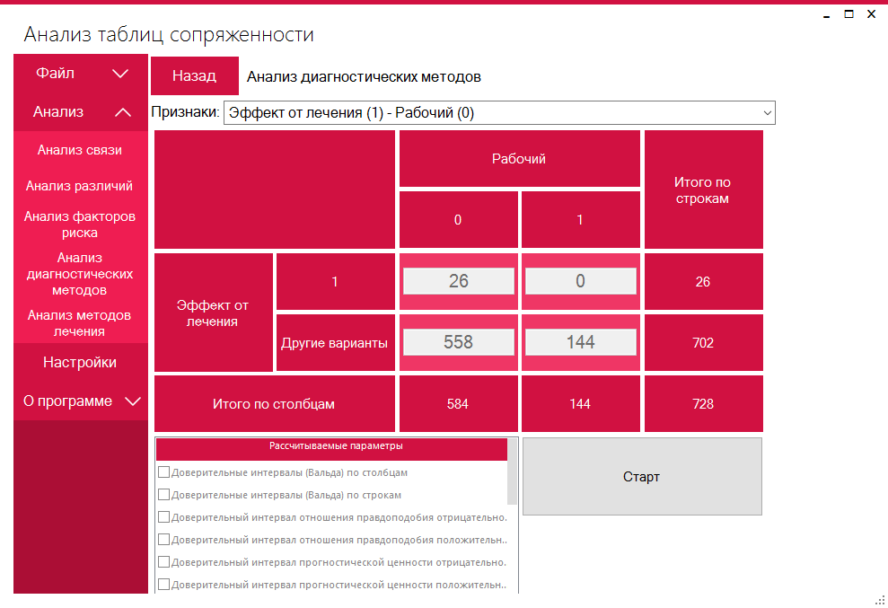
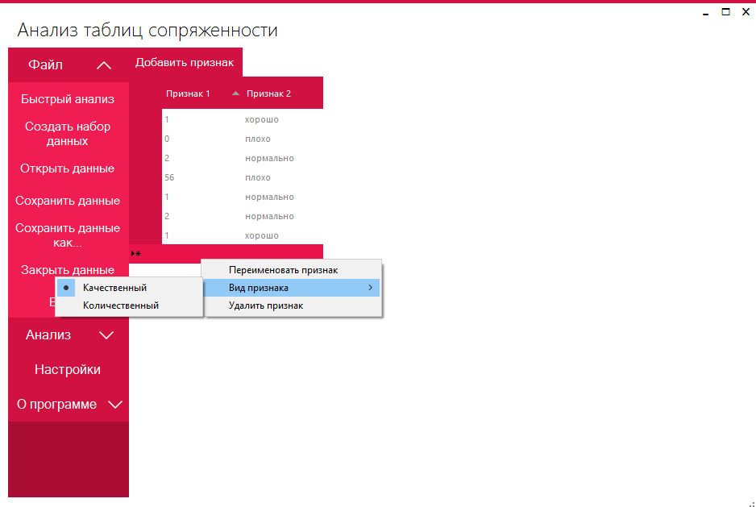
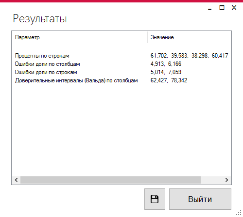
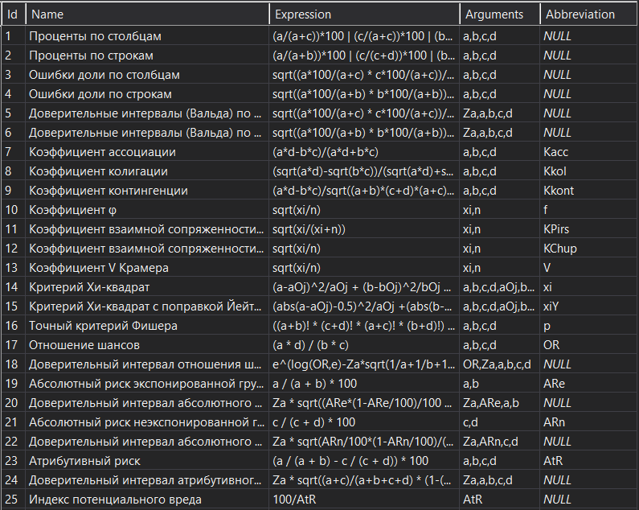

# Анализ таблиц сопряженности
## Что это такое
Анализ [таблиц сопряженности](https://ru.wikipedia.org/wiki/Таблица_сопряжённости) - метод статистического анализ зависимости между переменными. Это приложение, написанное на WinForms, реализует данный метод.
### Примеры

### Интересные моменты
Одним из интересных моментов реализации данного приложение является непосредственно само вычисление функций. Проблема заключается в том, что перед тем,как вычислить значение функции, следует вычислить значения ее аргументов. [Решением](https://github.com/ekostenkodev/ContingencyTableAnalysis/blob/master/ContingencyTableAnalysis/ContingencyTableAnalysis/Calculations.cs) является простой рекурсивный перебор каждого аргумента.

## Ссылки
Автор - ekostenkodev@gmail.com
